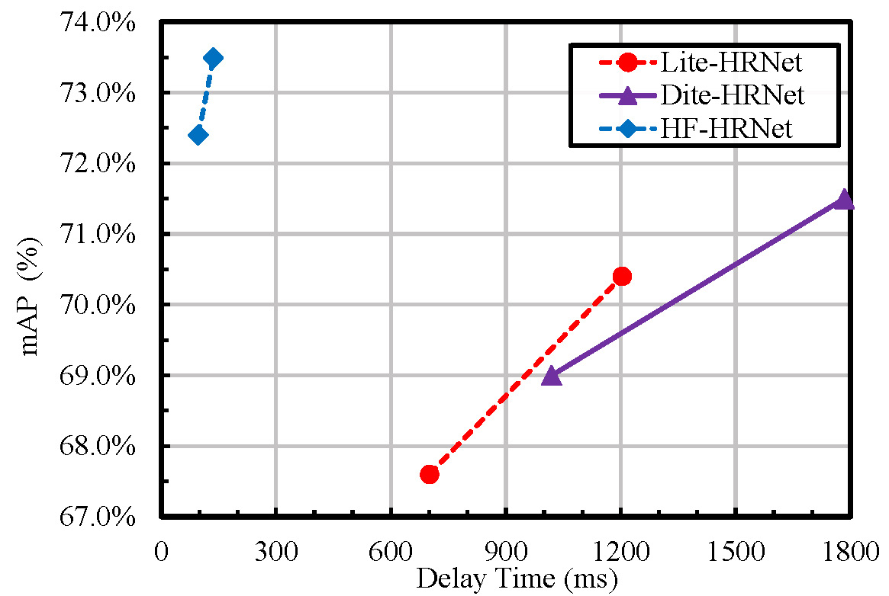
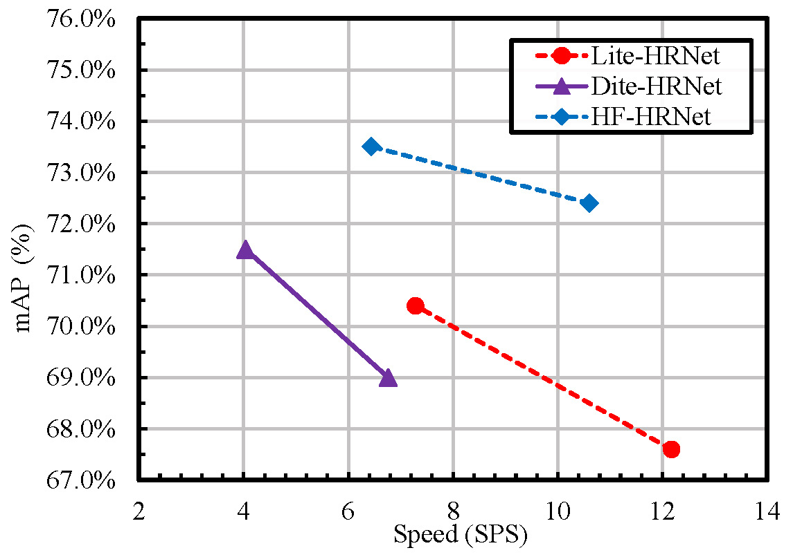

# HF-HRNet
About The official repo for paper: HF-HRNet: A Simple Hardware Friendly High-Resolution Network

# **News**
2023/09/18 Code is open source.

# **Abstract**:

High-resolution networks have made significant progress in dense prediction tasks such as human pose estimation and semantic segmentation. To better explore this high-resolution mechanism on mobile devices, Lite-HRNet incorporates shuffle operations to reduce computational complexity in the channel dimension, while Dite-HRNet employs dynamic convolution and pooling to capture long-range interactions with low computational complexity in the spatial dimension. 
The core idea behind both approaches is to efficiently capture information in either the channel or spatial dimension.
However, shuffle operations and dynamic operations are not hardware-friendly. As a result, both Lite-HRNet and Dite-HRNet cannot achieve the desired inference speed on specialized devices, including Neural Processing Units (NPUs) and Graphics Processing Units (GPUs).
To overcome these limitations, we present a simple Hardware-Friendly Lightweight High-resolution Network (HF-HRNet) based on our proposed Hardware-Friendly Uniform-sized Mug (HUM) block. HUM block mainly consists of the Cascaded Depthwise (CAD) block and Multi-Scale Context Embedding (MCE) block. The CAD block cascades depthwise convolutions to obtain a larger receptive field in the spatial dimension, while the MCE block aggregates multi-scale spatial feature information from different scales and adjusts channel features.
Extensive experiments are conducted on human pose estimation (COCO, MPII) and semantic segmentation (Cityscapes), resulting in a better trade-off between inference speed and accuracy on both NPUs and GPUs.
It is noteworthy that on the COCO test-dev set, HF-HRNet-30 outperforms Dite-HRNet-30 and Lite-HRNet-30 by 1.9 AP and 2.8 AP, respectively, while running about 13 times faster and 9 times faster on NPUs, respectively.

# **Visualization Results**:
The trade-off between inference time and AP on COCO val set for several SOTA models. (a) Delay Time (ms) w/ AP tested on NPU (RK3588). (b) Samples Per Second (SPS) w/ AP tested on GPU (NVIDIA A100-SXM-80GB). 
Note that ``Dynamic Kernel Aggregation" cannot be supported by NPU, we replace it with Squeeze-and-Excitation block when we measure the delay time on NPU.

    
    

# **Acknowledgement**:
This project is developed based on the [MMPOSE](https://github.com/open-mmlab/mmpose)
